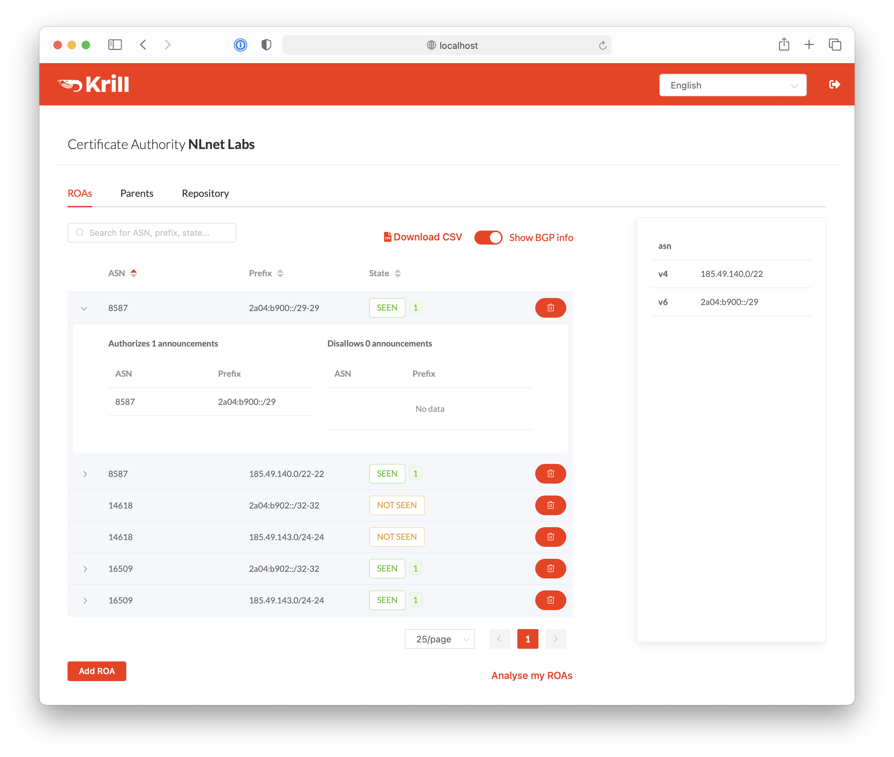

.. _doc_krill:

Krill
=====

Krill is a free, open source Resource Public Key Infrastructure (RPKI) daemon,
featuring a Certificate Authority (CA) and publication server, written by `NLnet
Labs <https://nlnetlabs.nl>`_.

Using Krill, you can run your own RPKI Certificate Authority as a child of one
or more parent CAs, usually your Regional Internet Registry (RIR) or National
Internet Registry (NIR). 

Krill is especially convenient if your organisation holds address space in
several RIR regions, or if your organisation represents multiple entities. All
ASNs and IP resources you have across the various entities and RIR regions are
presented as a single pool, allowing you to manage ROAs seamlessly.

Krill can also act as a parent for child CAs. This means you can delegate some
of your resources down to children of your own, such as business units,
departments or customers, who, in turn, manage ROAs themselves.

Krill can be managed with a web user interface, from the command line and
through an API. The powerful user interface shows the RPKI validation status of
your BGP announcements, warns about possible issues, and offers suggestions on
ROAs you may want to create or remove. Prometheus endpoints offer monitoring
of system status, ROA misconfigurations and possible BGP hijacks.

You are welcome to ask questions or post comments and ideas on our `RPKI mailing
list <https://nlnetlabs.nl/mailman/listinfo/rpki>`_. If you find a bug in Krill,
feel free to `create an issue <https://github.com/NLnetLabs/krill/issues>`_ on
GitHub. Krill is distributed under the Mozilla Public License 2.0.

**Table of Contents**

.. toctree::
   :maxdepth: 2
   :name: toc-krill

   before-you-start
   architecture
   install-and-run
   get-started
   manage-roas
   cli
   api
   multi-user
   monitoring
   failure-scenarios
   publication-server
   docker
.. history
.. authors
.. license
