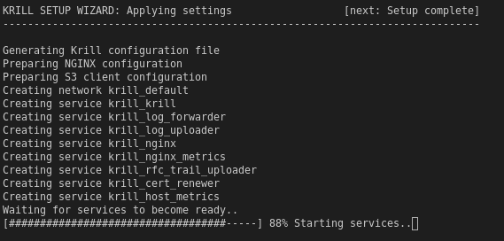

.. _doc_krill_manager_wizard_applying_settings:

Wizard: Applying Settings
=========================

At this stage the wizard has everything it needs to generate application
configuration files based on the settings chosen in the earlier wizard pages
and to launch the applications:

Once the applications are running the wizard will configure the CA Name you
requested (assuming no CA exists already), and in self-publishing mode the
embedded Krill repository will be configured for use by the newly created
CA:

----

**TO DO** Add a screenshot of Krill configuration.