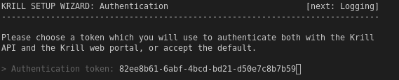

.. _doc_krill_manager_wizard_authentication:

Wizard: Authentication
======================

The Krill UI and API are secured by an authentication token. In this step of
the wizard you can choose the token to use, or accept a token generated by
Krill Manager for you:

