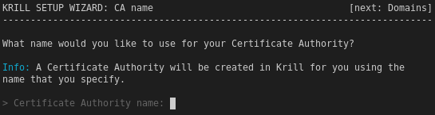

.. _doc_krill_manager_wizard_ca_name:

Wizard: CA Name
====================

Normally with Krill when first visiting the web UI you will be prompted to enter
the name of your Certificate Authority.

Krill Manager streamlines this process by asking you for the Certificate
Authority name during the Krill Manager wizard. Once the wizard is complete Krill
Manager will automatically create a CA in Krill by the name that you give here:

From :ref:`doc_krill_using_ui`:

.. epigraph::

   The handle you select is not published in the RPKI but used as identification to
   parent and child CAs you interact with. Please choose a handle that helps others
   recognise your organisation. Once set, the handle cannot be changed.

The CA name:
  - Can be used with the Krill API to manipulate the CA.
  - Will be shown in the Krill web UI.
  - Will appear as a component in URIs contained in RRDP snapshot XML and delta
    XML content.
  - Will be used as a component in the Rsync repository path for fetching content
    with the Rsync protocol.
  - Will appear inside ``.roa`` and ``.mft`` objects served via RRDP and Rsync.