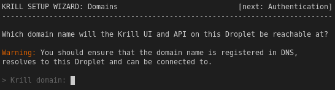

.. _doc_krill_manager_wizard_domains:

Domains
=======

Next Krill Manager needs to know which domain names Krill and, if hosting your
own repository (see :ref:`doc_krill_manager_wizard_publication_mode`), NGINX and Rsync servers will be
available to Internet clients at.

.. Note:: The domain names that you enter in this page of the wizard should
             already be configured to point at your Krill Manager IP address.

.. Tip:: Later in the process the wizard will offer to obtain Let's Encrypt
         certificates on your behalf for the Krill and RRDP domains that you
         supply on this page of the wizard.

3rd Party Mode
--------------

When using a 3rd party repository to publish ROAs Krill Manager only needs to
know which domain the Krill UI and API will be available at:

   A Krill Manager instance in 3rd party mode.

Self-Publishing Mode
--------------------

Alternatively, when hosting your own repository, Krill Manager will need to
know which domain name the RRDP and Rsync servers will be available at.

.. Note:: This step assumes that Krill Manager will run the RRDP and Rsync
   servers for you. Running the RRDP and Rsync servers yourself is outside
   the scope of these instructions.

**TO DO** *Include a screenshot in self-publishing mode.*

Domain Validity
---------------

The domain names you enter should be valid. As properly validating domain names
is complicated and as the given domain names should already be configured to
point to the Krill Manager instance, Krill Manager attempts to lookup the DNS
records for the given domain names. If not found, Krill Manager will warn you.

If you **know** that the domain name is correct but DNS propagation has not
completed yet, or for some other reason you would like to proceed, Krill
Manager allows you to ignore the lookup failure:

.. figure:: img/domains-invalid.png
   :alt: Wizard intiial domains page screenshot with an invalid domain.

   Krill Manager warning about an unresolvable domain name.