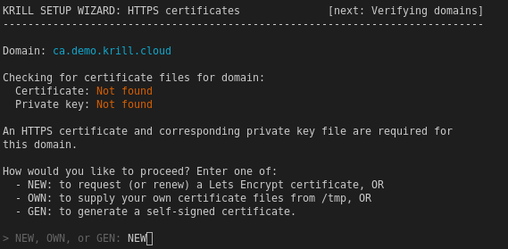
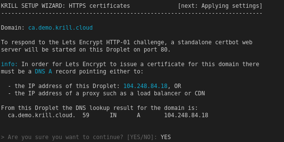
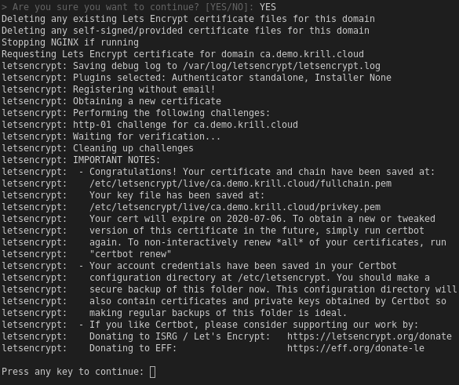

.. _doc_krill_manager_wizard_https_certificates:

Wizard: HTTPS Certificates
==========================

.. Tip::
   See also:
     - :ref:`proxy_and_https`
     - `Let's Encrypt HTTP-01 challenge <https://letsencrypt.org/docs/challenge-types/#http-01-challenge>`_

As advised in :ref:`proxy_and_https`, Krill Manager makes Krill available to
the Internet via the NGINX proxy server. When running in self-publishing mode
(see :ref:`doc_krill_manager_wizard_publication_mode`) NGINX is also used to
offer the RRDP protocol to Relying Party clients.

To secure the connection NGINX requires a TLS certificate, either provided by
you or requested on your behalf from `Let's Encrypt <https://letsencrypt.org/>`_
by the Krill Manager wizard.

For each domain that requires a TLS certificate (either just one domain for
Krill, or if using a separate domain for RRDP then that domain too) the wizard
checks whether or not it already has a certificate and asks how you would like
to proceed:

Enter one of:
  - ``NEW`` to request a new `Let's Encrypt <https://letsencrypt.org/>`_ certificate.
  - ``OWN`` to supply your own certificate files.
  - ``GEN`` to generate a self-signed certificate.
  - ``USE`` to use the existing certificate that the wizard found, if any.

------------------------
Self-Signed Certificates
------------------------

.. Error:: Do NOT use a self-signed certificate. In most cases a self-signed
           certificate is the wrong choice. Relying Party software will warn
           about or refuse to use an RRDP service using a self-signed
           certificate, users of the Krill UI will be required to accept the
           risks of using a self-signed certificate or their browser will
           refuse it entirely, and the ``krillc`` command line client will
           refuse to connect to the Krill API server.

--------------------------------
Using Let's Encrypt Certificates
--------------------------------

Certificate Renewal
-------------------

When using Let's Encrypt issued certificates Krill Manager will ensure that
they are renewed before they expire.

.. Warning:: When using your own certificates, instead of Krill Manager
             obtained Let's Encrypt certificates, you are responsible for
             replacing the certificate files before the certificates expire.

DNS and Firewall Requirements
-----------------------------

For Let's Encrypt to issue a TLS certificate the following requirements must be
met:

- A DNS A record for the domain name must point to the Krill Manager IP
  address.
- The DNS A record must have sufficiently propagated around the global DNS
  network such that multiple Let's Encrypt probe locations around the world
  can all resolve the name correctly.
- Port 80 on the Krill Manager instance must be open, both on the host and
  on any cloud firewall or proxy layer (e.g. load balancer) in front of
  the Krill Manager instance.

IP Address Verification
-----------------------

Prior to requesting a Let's Encrypt certificate the wizard will ask you to
confirm that DNS lookup results for the domain look correct.

Let's Encrypt Request Log
-------------------------

If you approve the wizard will then contact Let's Encrypt:

In this example the request succeeded. If any problems occured the log would
instead indicate the reason for the failure.

Once you press a key to continue you will be returned to the start of the HTTPS
Certificatess wizard page. The wizard will verify if it now has a certificate
for the domain and if so will give you the option to ``USE`` it:

.. figure:: img/https-certificates-found.png
   :alt: Wizard HTTPS certificates page screenshot of a found certificate.
