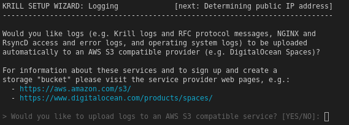
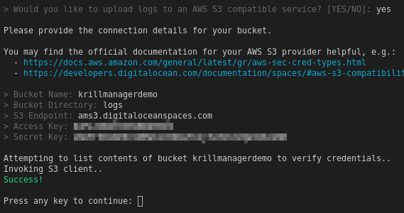

.. _doc_krill_manager_wizard_logging:

Wizard: Logging
===============

.. Tip::
   See also:
     - `Amazon S3 product details <https://aws.amazon.com/s3/>`_ & `Getting your security credentials <https://docs.aws.amazon.com/general/latest/gr/aws-sec-cred-types.html>`_
     - `DigitalOcean Spaces product details <https://www.digitalocean.com/products/spaces/>`_ & `AWS S3 Compatibility <https://developers.digitalocean.com/documentation/spaces/#aws-s3-compatibility>`_
     - `Wikipedia: S3 API and competing services <https://en.wikipedia.org/w/index.php?title=Amazon_S3&section=7#S3_API_and_competing_services>`_

If you have an account with a 3rd party S3-like service such as
`DigitalOcean Spaces <https://www.digitalocean.com/products/spaces/>`_, Krill
Manager can use it to store copies of the logs from your host operating
systemd and the various Krill Manager operated services, including Krill RFC
exchange logs.

Enter:
  - ``NO`` to skip this page and continue with the wizard.
  - ``YES`` to provide your S3-like service connection details.

.. Warning:: If you do not choose to upload logs they are still available to
             you but in the event that the host suffers a failure you will lose
             these logs unless you capture them as part of a periodic backup
             process.

.. Tip:: You can re-run ``krillmanager init`` later to enable log upload.
         However, note that only new logs from that moment on will be uploaded.

Providing Connection Details
----------------------------

After answering ``YES`` you will be prompted to enter the S3-like service
connection and authentication details. You will need to obtain these from your
S3-like service service provider.

The wizard will try to detect the environment that it is running in and provide
sensible default values where possible, e.g. in the example below the
``S3 Endpoint`` value was set by the wizard based on the fact that the Droplet
on which Krill Manager was running was located in the DigitalOcean ``ams3``
region.

   Successful verification of DigitalOcean Spaces connection details.

Once the wizard has the connection and authentication details it will attempt
to verify them by trying to list the contents of the destination S3 bucket.

In the event that the connection and/or authentication details are incorrect the
wizard will output error messages instead of ``Success!`` and you will be
returned to the initial yes/no question where you can either choose to try
again or continue without log uploading at this time.

Upload Frequency
----------------

RFC protocol exchange logs are uploaded hourly. All other logs are uploaded at
least every 10 minutes, more frequently if there is a lot of logging activity.

Log Retention
-------------

When log upload is enabled, local copies of Krill RFC audit logs are deleted
after two days as these logs can become quite large. All other logs are rotated
according to the `systemd` journal default behaviour.

Upload Structure
----------------

Logs are uploaded to a structure similar to the following:

.. code-block:: bash
 
   /<Bucket Directory>/rfc_trail
   /<Bucket Directory>/YYYMMDDHH/<hostname>/<source>.gz
   /<Bucket Directory>/YYYMMDDHH/<hostname>/<container>/<instance id>.<N>.gz

Where ``<Bucket Directory>`` is the value you provided to the wizard.

Advanced Client Configuration
-----------------------------

Some S3-like services, in particular the original AWS S3, support many options
such as client-side encryption, batch upload, etc. Use of some advanced
settings is possible but not yet via the wizard.