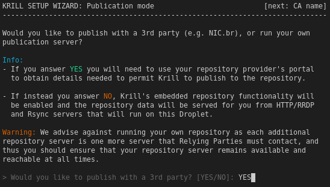

.. _doc_krill_manager_wizard_publication_mode:

Wizard: Publication Mode
=============================

Krill can operate in one of two modes:
  - Publish with a 3rd party
  - Publish in its own repository

The publication mode wizard page lets you choose which of these modes Krill
will be configured for:

3rd Party Mode
--------------

In 3rd party mode your Krill instance will **only** be a Certificate Authority
and you will need to configure it to publish any ROAs with an external
repository, e.g. that of a parent such as NIC.br.

Answering ``YES`` will enable 3rd party mode.

Self-Publishing Mode
--------------------

In self-publishing mode the ROA objects created by your Krill instance will be
made available by Krill Manager to Internet clients via the RRDP and Rsync
protocols.

Answering ``NO`` will enable self-publishing mode.

.. Note:: The wizard may need to ask you for additional information in later
          pages in order to complete the setup for self-publishing mode.