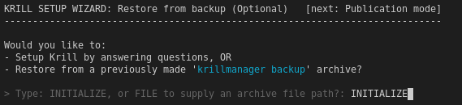
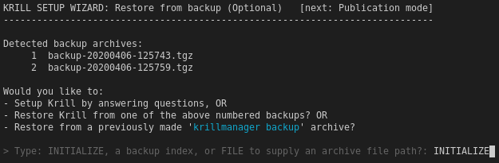

.. _doc_krill_manager_wizard_restore_from_backup:

Restore from backup
===================

A Krill Manager backup is a complete copy of all of the application settings
and data files for applications managed by Krill Manager, e.g. including Krill
settings, NGINX certificate and key files, a record of your wizard choices,
the RRDP and Rsync content files, application logs, etc.

If you previously made such a backup using the ``krillmanager backup`` command
on this or another Krill Manager instance (and in the latter case transported
the backup archive to this instance) you can choose at this point to set up
this Krill Manager instance using the data in the backup archive, instead of
answering wizard questions to setup Krill Manager from scratch.

With or Without Existing Backups
--------------------------------

In most cases the restore from backup wizard page will look like this:

   A Krill Manager instance with no backup archives present.

If however you have previously used the ``krillmanager backup`` command
on this Krill Manager instance, you will see the backup archives the command
created listed on this page:

   A Krill Manager instance with backup archives present.

Krill Manager has no way of knowing about backup archives that you might have
copied to the filesystem from an external storage location or from another
server and so also provides an option for you to specify the path to the
backup archive manually.

Initialize or Restore
---------------------

Enter one of:

- ``INITIALIZE`` to skip this page and continue setting up Krill Manager from
  scratch.
- ``N`` where N is the number of a listed backup that you would like to
  restore.
- ``FILE`` to specify the path to a backup archive to restore, e.g. that you
  have previously copied to the system with the ``scp`` command.

.. Note:: If you choose a backup to restore from the wizard will complete the 
          restore process and then exit with a status summary of the running
          Krill deployment.