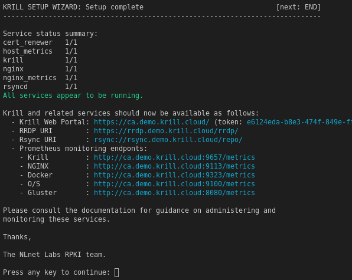
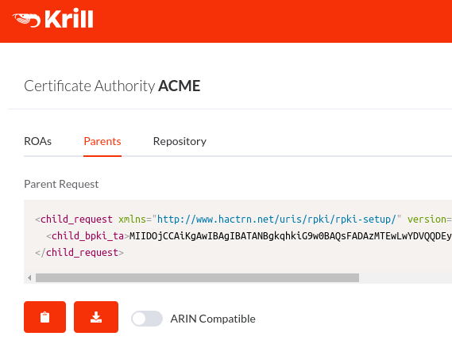

.. _doc_krill_manager_wizard_setup_complete:

Wizard: Setup Complete
======================

Once everything is setup the wizard will report the status of the running
services and the locations at which the services can be found:

Verify that Krill is Running
----------------------------

Use the ``Krill Web Portal`` link and token to login to the Krill UI where
you should see your newly created Certificate Authority and the details
required to link your CA to a parent:

Refer to the :doc:`Krill Documentation </krill/index>` to learn more about
Krill.

Next Steps
----------

Click Next or return :doc:`to the index </krill/krillmanager/index>` to
continue learning about Krill Manager.