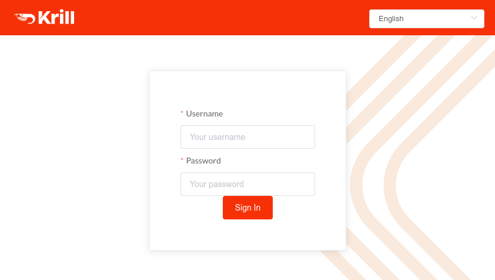

.. _doc_krill_multi_user_config_file_provider:

Config File Users
=================

.. versionadded:: v0.9.0

By setting ``auth_type = "config-file"`` in ``krill.conf`` you can configure Krill
to require users to enter a username and password in the web user interface when
logging in, rather than the secret token that is usually required:

    Enter config file user credentials to access Krill

How does it work?
-----------------

To add a user to the ``krill.conf`` file an administrator uses the ``krillc``
command to compute a password *hash* for the user and then adds an entry to the
``[auth_users]`` section including their username, password *hash* and any :ref:`attributes <doc_krill_multi_user_access_control>`
that are relevant for that user.

When a user enters their username and password into the web user interface a 
hash of the password is computed and sent with the username to the Krill server.

.. tip:: The actual user password is **NEVER** stored on either the Krill server
         nor the client browser and is **NEVER** sent by the client browser to
         the Krill server. Only password *hashes* are stored and transmitted.

.. warning:: Do **NOT** serve the Krill web user interface over unencrypted HTTP.
             While the password is never transmitted, the authentication token
             that the user is subsequently issued is subject to interception
             by malicious parties if sent unencrypted from the Krill server to
             the web user interface. Note that this is equally true when using
             any credential to authenticate with Krill, whether secret token
             or password hash or when Krill is configured to interact with an
             OpenID Connect provider.

Known limitations
-----------------

Locally defined users are easy to define and give you complete control over who
has access to your Krill instance and what level of access is granted. However,
Krill is not a complete user management system and so there are some things to
remember when using locally defined users:

- Krill has no feature for requiring a user to change their password on first
  login. As such, by issuing users with passwords you become responsible for
  delivering the new password to them securely.

- Krill has no feature for generating cryptographically strong passwords. You
  are responsible for choosing sufficiently strong passwords for your users.

- Usernames, password hashes and user attributes are sensitive information. By
  adding them to your ``krill.conf`` file you become responsible for protecting
  them.

- If you lose you ``krill.conf`` file you will also lose the password hashes
  and will have to reset your users passwords unless you have a (**secure**)
  copy elsewhere.

- If a user forgets their password you will need to issue them with a new one.
  Krill does not offer a forgotten password or password reset feature.

- Adding or changing users requires a restart of Krill. There is no support in
  Krill at present for reloading the user details while Krill is running.
  While Krill is restarting the web user interface will be unavailable for your
  users.

Setting it up
-------------

The following steps are required to use local users in your Krill setup:

1. Decide on the settings to be configured.
"""""""""""""""""""""""""""""""""""""""""""

Decide which usernames, passwords and user attributes you are going to
configure.

Unless you are using a :ref:`custom authorization policy <doc_krill_multi_user_custom_policies>`
you should choose a :ref:`role <doc_krill_multi_user_access_control>`
for each user, and optionally zero or more certificate authority handles
to which the user should be granted or denied access.

You should also decide if any of the user attributes are sensitive and
should therefore not be shown in the Krill web user interface.

2. Configure Krill
""""""""""""""""""

Add an ``auth_type = "config-file"`` line to your ``krill.conf`` file.
Remove or comment out any existing ``auth_type = ...`` line if present.

For each user, use ``krillc config user --id <user id>`` to generate a
password hash. **Note:** You may need to use quotes around the user id
if it contains characters which your shell treats specially.

``krillc`` will prompt you to enter a password for the user and will
respond with a sample ``[auth_users]`` configuration block (including the
generated password hash) for you to add to the ``krill.conf`` file.

For example:

.. code-block:: bash

   $ krillc config user --id joe@example.com
   Enter the password to hash: some password
   
   [auth_users]
   "joe@example.com" = { password_hash="..." }

Repeat this step for each of the users that you need to configure.

**Note:** at the end there should only be one ``[auth_users]`` section in
your ``krill.conf`` file, for example:

.. code-block:: bash
   
   [auth_users]
   "joe@example.com"  = { attributes={ role="admin", password_hash="..." } }
   "sally"            = { attributes={ role="readonly", inc_cas="ca1, ca3", password_hash="..." } }
   "dave_the_octopus" = { attributes={ role="readwrite", exc_cas="some_private_ca", password_hash="..." } }

**(Optional)** Mark any sensitive attributes as private by adding a
``auth_private_attributes = [ "attr name", ... ]`` line in your
``krill.conf`` file (replacing the value "attr name" with the correct
attribute name!).

3. Go!
""""""

Restart Krill and deliver the chosen passwords to the respective users to
whom they belong.

.. Warning:: Take whatever steps you think are necessary to ensure that the
             passwords are delivered **securely** to your users.

Additional sources of information
---------------------------------

The ``krill.conf`` file is the definitive guide to the possible values that
can be used in the Krill configuration file. If in doubt, consult the 
``krill.conf`` file that came with your copy of Krill.

Login related events will be reported in the Krill logs:

- Login failures are reported at error level.
- Login successes are reported at info level.
- Additional diagnostics may be reported at debug or trace level.