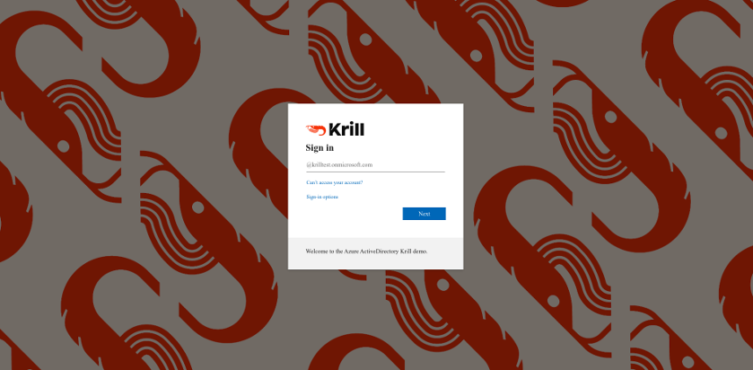
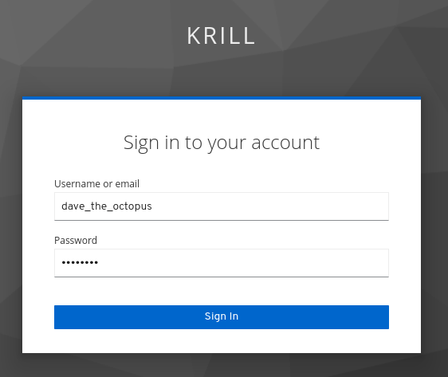
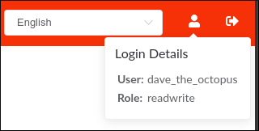

.. _doc_krill_multi_user_openid_connect_provider:

OpenID Connect Users
====================

.. versionadded:: v0.9.0

.. contents::
  :local:
  :depth: 1

Introduction
------------

`OpenID Connect <https://openid.net/connect/>`_ is a widely supported
standard that builds on the OAuth 2.0 standard to authenticate users
and provide basic profile information about those users.

The user visible part of the login experience when using OpenID Connect is
handled by the OpenID Connect provider and may look quite different to the
Krill web user interface:

    Using Azure Active Directory as an OpenID Connect provider with Krill

To use OpenID Connect Users in Krill you will either need to run your own
OpenID Connect provider or use one provided by a 3rd party service
provider.

Why OpenID Connect?
"""""""""""""""""""

From the `OpenID Connect FAQ <https://openid.net/connect/faq/>`_:

  **What problem does OpenID Connect solve?**

  *It lets app and site developers authenticate users without taking on the
  responsibility of storing and managing passwords in the face of an
  Internet that is well-populated with people trying to compromise your
  users’ accounts for their own gain.*

OpenID Connect takes the lessons learned from earlier identity protocols
and improves on them. It is `widely implemented <https://openid.net/developers/certified/>`_
and deployed, and for situations where the primary identity provider does
not implement OpenID Connect there are OpenID Connect providers that can
act as a bridge to systems that implement other identity protocols.

As a modern, tried & tested and widely implemented protocol it is therefore
quite likely that it is either already in use by (potential) Krill
operators or viable for them to adopt.

Why not OAuth 2.0?
"""""""""""""""""""

From https://oauth.net/articles/authentication/:

  **OAuth 2.0 is not an authentication protocol.**

  *Much of the confusion comes from the fact that OAuth is used inside of
  authentication protocols, and developers will see the OAuth components
  and interact with the OAuth flow and assume that by simply using OAuth,
  they can accomplish user authentication. This turns out to be not only
  untrue, but also dangerous for service providers, developers, and end
  users.*

How does it work?
-----------------

Let's assume that the OpenID Connect provider is compatible with Krill and
that Krill has been registered with the provider (see below for more on
these topics).

The user experience
"""""""""""""""""""

When an end user visits the Krill website in their browser they will be
redirected to the login page of the OpenID Connect provider. This is
**NOT** part of Krill.

For example, when logging in to a Krill instance connected to the OpenID
Connect provider in a large company, the end user might see a very familiar
login page. That's because it is probably a page they have to login to in
order to use many other services in their company. Often this login page
will even be themed to match the corporate branding.

The user enters **their** credentials into the OpenID Connect provider
login page. At this point Krill knows nothing about who is logging in at
the provider login form.

.. tip:: Krill **NEVER** receives the username or password that the user
         enters in to the OpenID Connect provider login page and Krill has
         no control over the appearance and/or behaviour of the OpenID
         Connect provider login page.

If the login is successful, from the users perspective their browser is
then directed back to Krill where they see the Krill web user interface as
if they are logged in. Krill will provide the web user interface with a
token which the web user interface should send on subsequent requests to
authenticate itself with Krill. The web user interface will keep a copy of
this token in browser local storage until the user logs out or is timed
out due to inactivity.

Krill will honour any session expiration time communicated to it by the
OpenID Connect provider. When using OpenID Connect Users it is therefore
possible that the user will be informed that they cannot perform the
requested action because their login session has timed out and they need
to login again. Where possible Krill will automatically extend the login
session to avoid this happening.

In the background
"""""""""""""""""

What the user doesn't see, except perhaps if their network connection is
very slow, is that there are "hidden" intermediate steps occuring in the
login flow, between the browser and Krill and between Krill and the OpenID
Connect provider. These steps implement the OpenID Connect `"Authorizaton
Code Flow" <https://openid.net/specs/openid-connect-core-1_0.html#CodeFlowAuth>`_.

If the user logged in correctly at the OpenID Connect provider login page
and Krill was correctly registered with the provider and the provider was
correctly setup for Krill, then Krill will receive a temporary Authorization
Code which it exchanges for an OAuth 2.0 `Access Token <https://www.oauth.com/oauth2-servers/access-tokens/>`_
(and maybe also an OAuth 2.0 Refresh Token) and an OpenID Connect ID Token.

The ID Token includes so-called OAuth 2.0 **claims**, metadata about the
user logging in. These claims are the key to whether or not Krill is able
to determine which rights, if any, to grant to the user that is attempting
to login.

Known limitations
-----------------

OpenID Connect Users avoid the problems with :ref:`Config File Users <doc_krill_multi_user_config_file_provider>`
but require more effort to setup and maintain:

- Requires operating another service or using a 3rd party service.
- Confguring Krill and the OpenID Connect provider is more involved than
  setting up :ref:`Config File Users <doc_krill_multi_user_config_file_provider>`.
- If Krill cannot contact the OpenID Connect provider, users will be
  unable to login to Krill with their OpenID Connect credentials. It will
  however still be possible to authenticate with Krill using its secret
  token.

Choosing a provider
-------------------

There are many identity providers that support OpenID Connect to choose
from. Some are software products that you can host yourself, others are
online services that you can create an account with.

Any OpenID Connect provider that you choose must implement the following standards:

- `OpenID Connect Core 1.0 <https://openid.net/specs/openid-connect-core-1_0.html>`_
- `OpenID Connect Discovery 1.0 <https://openid.net/specs/openid-connect-discovery-1_0.html>`_
- `OpenID Connect RP-Initiated Logout 1.0 <https://openid.net/specs/openid-connect-rpinitiated-1_0.html>`_ *(optional)*
- `RFC 7009 OAuth 2.0 Token Revocation <https://tools.ietf.org/html/rfc7009>`_ *(optional)*

Krill has been tested with the following OpenID Connect providers (in alphabetical order):

- `Amazon Cognito <https://docs.aws.amazon.com/cognito/latest/developerguide/open-id.html>`_
- `Keycloak <https://www.keycloak.org/docs/latest/server_admin/index.html#oidc-clients>`_
- `Microsoft Azure Active Directory <https://docs.microsoft.com/en-us/azure/active-directory/fundamentals/auth-oidc>`_
- `Micro Focus NetIQ Access Manager 4.5 <https://www.netiq.com/documentation/access-manager-45-developer-documentation/administration-rest-api-guide/data/oauth-openid-connect-api.html>`_

.. warning:: Krill has been verified to be able to login and logout with `Google Cloud <https://developers.google.com/identity/protocols/oauth2/openid-connect>`_
             accounts. However, it is not advisable to grant access to
             Google accounts in general. Instead you should use a
             Google product that permits you to manage your own pool of
             users so that you can restrict access to just these users.
             Additionally, if you wish to assign different Krill rights
             to different users you will need some way to mark the
             users to indicate which role they should receive, e.g. by
             grouping them or `configuring custom claims <https://cloud.google.com/identity-platform/docs/how-to-configure-custom-claims>`_.

Setting it up (overview)
------------------------

The process for setting up Krill to support login by users of an OpenID
Connect provider follows the same basic pattern for all providers but
differs greatly in the details from one provider to the next.

In short, to setup any OpenID Connect provider with Krill the following
steps must be taken:

1. **Decide on the settings to be configured**
   
   Ensure you have the basic pieces of information that you need. For
   example:

     - Which URL will Krill be available at?
     - Which user(s) will have admin rights in Krill?
     - Is there some property of these users that distinguishes them
       from other users (for example they may already be members of some
       internal Active Directory group) or will you need to mark them out
       in some way so that Krill can spot that they should be admins?

2. **Gain access to the provider**

   This could be installing and operating provider software yourself, or
   signing up to a cloud service, or arranging for support from your
   internal IT department to have changes made to your in-house provider
   on your behalf.
   
   \

3. **Register Krill with the provider**
   
   You will need to supply the Krill redirect URLs: [1]_

     - https://yourdomain/auth/callback
     - https://yourdomain/ *(if the provider supports Connect RP-Initiated
       Logout 1.0)*

   You should receive back from the registration process three pieces of
   information that will be needed to configure Krill:

   - The provider OpenID Connect Discovery 1.0 issuer URL [2]_
   - A client ID
   - A client secret

   \

   .. [1] Alternatively your provider may support wildcard redirect URLs in
      which case you can supply https://yourdomain/\*. However wildcard URLs
      are not advised as they could potentially be abused to redirect
      requests to other locations.
   
   .. [2] A correct URL will either end in /.well-known/openid-configuration
      or should that appended to it, e.g. the Google issuer URL is: https://accounts.google.com/.well-known/openid-configuration

4. **Create users, groups and/or claims in the provider**
   
   If all of your users will have admin rights in Krill you can ignore
   groups and claims and just create users.

   If however you want some users to have different rights than other users
   you will need to configure your provider to include some hint about the
   role that a user should have in the claims data that it sends to Krill.

   The manner in which this is setup varies greatly by provider. With
   Keycloak for example you have direct control over the claim data that is
   exposed to the OpenID Connect client and have multiple different ways to
   tell Krill via the claims data which role each user should have in Krill.

   With Azure Active Directory however you are by default limited to only
   being able to expose claims that it defines or to add users to groups.
   The group memberships can be exposed as claim data and Krill can parse
   the group data and match against it.

   \

5. **Configure additional provider features**

   How long are the tokens issued by the provider valid for? Can the
   provider issue refresh tokens? These properties affect how long a user
   can remain logged in to Krill.
   
   You should also ensure that the provider has a real TLS certificate, or
   for in-house certificates you will need a copy of the Certificate
   Authority root certificate so that you can configure Krill to trust it.
   If neither are possible you can configure Krill to trust the insecure
   certificate anyway, but this is not advised.

   \

6. **Configure Krill**

   Lastly, add the issuer URL, client ID and client secret to ``krill.conf``
   and if necessary configure any claim mapping rules to instruct Krill how
   to obtain role information from the claims data that it will be sent.

   You may also need to use some of the other OpenID Connect specific
   configuration settings that Krill offers. For example to use the Amazon
   Cognito logout endpoint you have to configure that manually.

   .. tip:: The ``krill.conf`` file contains example configurations for
            providers that Krill has been tested with.

Setting it up (using Keycloak)
------------------------------

In this section you will see how to setup `Keycloak <https://www.keycloak.org/>`__
as an OpenID Connect provider for Krill.

The following steps are required to use OpenID Connect Users in your Krill setup.

1. Decide on the settings to be configured.
"""""""""""""""""""""""""""""""""""""""""""

For this example let's assume we want to configure the following users:

================= ================= ========= =========
Username          Email             Password  Role
================= ================= ========= =========
joe@example.com   joe@example.com   dFdsapE5  admin
sally             sally@example.com wdGypnx5  readonly
dave_the_octopus  dave@example.com  qnky8Zuj  readwrite
================= ================= ========= =========

And let's assume that we are going to use a local Docker `Keycloak <https://www.keycloak.org/>`__
container as our OpenID Connect provider which will be running at
https://localhost:8443/.

----

2. Configure the provider
"""""""""""""""""""""""""

Let's walk through configuring the provider step by step:

.. contents::
  :local:
  :depth: 1

Download and run Keycloak
~~~~~~~~~~~~~~~~~~~~~~~~~

.. code-block:: bash

   $ sudo docker run \
       --detach \
       --name keycloak \
       --publish 8443:8443 \
       --env KEYCLOAK_USER=admin \
       --env KEYCLOAK_PASSWORD=password \
       --env DB_VENDOR=h2 quay.io/keycloak/keycloak:12.0.4

.. warning:: Do **NOT** run Keycloak like this in production. This
             command instructs Keycloak to use an in-memory H2
             database which is convenient for demonstration and
             testing purposes but should not be used in a production
             setting.

Follow the logs until Keycloak is ready:

.. code-block:: bash

   $ docker logs --follow keycloak
   ...
   14:31:20,766 INFO  [org.jboss.as] (Controller Boot Thread) WFLYSRV0025: Keycloak 12.0.4 (WildFly Core 13.0.3.Final) started in 23954ms - Started 687 of 972 services (687 services are lazy, passive or on-demand)
   14:31:20,768 INFO  [org.jboss.as] (Controller Boot Thread) WFLYSRV0060: Http management interface listening on http://127.0.0.1:9990/management
   14:31:20,769 INFO  [org.jboss.as] (Controller Boot Thread) WFLYSRV0051: Admin console listening on http://127.0.0.1:9990

Login to the Keycloak admin UI
~~~~~~~~~~~~~~~~~~~~~~~~~~~~~~

- Browse to https://localhost:8443/.
- Accept the self-signed TLS certificate.
- Click on `Administration Console`.
- Login as user `admin` password `password`.

Create a realm
~~~~~~~~~~~~~~

.. note:: A realm is a Keycloak concept and is a good example of how
          providers differ in what needs to be done to set them up.

- Hover over `Master` in the top left and click on the `Add Realm`
  button that appears.
- Set the field values as follows then click `Create`:

  ===================  ======================================
  Field                Value
  ===================  ======================================
  Name                 `krill`
  ===================  ======================================

Create a client application
~~~~~~~~~~~~~~~~~~~~~~~~~~~

.. tip:: This is where we register Krill with the OpenID Connect provider.

Continuing in the KeyCloak web UI with realm set to `krill`:

- Click `Clients` (top left) then `Create` (top right).
- Set the field values as follows then click `Save`:

  ===================  ======================================
  Field                Value
  ===================  ======================================
  Client ID            `krill`
  ===================  ======================================

- On the `Settings` tab that is shown next set the field values as
  follows then click `Save` at the bottom.

  ===================  ======================================
  Field                Value
  ===================  ======================================
  Access Type          `confidential` [3]_
  Valid Redirect URIs  `https://localhost:3000/*` [4]_
  ===================  ======================================

- Generate credentials for Krill to use:

  - Open the `Credentials` tab (at the top).
  - Copy the `Secret` value somewhere safe, we'll need it later.

.. [3] Krill is an OAuth 2.0 "Confidential Client" as defined
       in `RFC 6749 Section 2.1 <https://tools.ietf.org/html/rfc6749#section-2.1>`_.
.. [4] We could configure this explicitly as two separate
       redirect URLs: https://localhost:3000/auth/callback (for
       post-login) and https://localhost:3000/ (for post-logout).
       However, as this is a localhost demo and Keycloak supports
       wildcard redirect URLs we can keep it simple in this case.

Configure a role mapper
~~~~~~~~~~~~~~~~~~~~~~~

.. tip:: This is where we create custom claims that Krill can detect and
         use to determine which rights in Krill to assign to the user.

- Open the `Mappers` tab (at the top) and then click `Create`.
- Set field values as follows then click `Save` at the bottom:

  =====================  ======================================
  Field                  Value
  =====================  ======================================
  Name                   `krill_role`
  Mapper Type            `User Attribute`
  User Attribute         `role`
  Token Claim Name       `role`
  Claim JSON Type        `String`
  =====================  ======================================

Create the users
~~~~~~~~~~~~~~~~

- Click `Users` (on the left) then click `Add User` (top right).
- Set field values as follows then click `Save` at the bottom:

  =====================  ======================================
  Field                  Value
  =====================  ======================================
  Username               `<THE USERS NAME>`
  Email [5]_             `<THE USERS EMAIL ADDRESS>`
  =====================  ======================================

- Open the `Credentials` tab and set the field values as follows:

  =====================  ======================================
  Field                  Value
  =====================  ======================================
  Password               `<THE USERS PASSWORD>`
  Password Confirmation  `<THE USERS PASSWORD>`
  =====================  ======================================

- Leave `Temporary` set to `ON`. [6]_
- Click `Set Password`.
- When asked `"Are you sure you want to set a password for this user?"` click `Set password`.

- Open the `Attributes` tab.

  - Enter Key `role` with value `readonly` and press `Add`.
  - Click `Save` at the bottom.

Repeat the above adding the other users.

.. [5] By default Krill expects there to be an "email" claim in the ID
       Token response from the provider. If we didn't setup an email
       here we would need to define a claim mapping so that Krill could
       extract the `Username` value that we provide from some other
       claim field. In the case of Keycloak that would be the 
       `preferred_username` field. We'll revisit this topic later.

.. [6] This is a good example of where using an OpenID Connect provider
       has benefits over using :ref:`Config File Users <doc_krill_multi_user_config_file_provider>`.
       By leaving `Temporary` set to `ON`, Keycloak will require the
       user to change their password on first login. Krill doesn't have
       this functionality itself. We should still attempt to communicate
       an initial unique password securely to the user, but the
       opportunity for abuse is limited and we as admins won't know the
       actual password the user sets for themselves. 

----

3. Configure Krill
""""""""""""""""""

Add the following to your ``krill.conf`` file: (remove or comment out
any existing ``auth_type`` line)

.. parsed-literal::

   auth_type = "openid-connect"
   
   [auth_openidconnect]
   issuer_url = "https://localhost:8443/auth/realms/krill"
   client_id = "krill"
   client_secret = "<SECRET VALUE SAVED EARLIER>"
   insecure = true [7]_

.. [7] Do **NOT** use this in a production setting. We have to set `insecure`
       to `true` in this demonstration because our Keycloak instance does
       not have a real TLS certificate. Without `insecure` set to `true`
       Krill would reject the insecure self-signed TLS certificate.

----

4. Go!
""""""

Restart Krill and browse to the Krill web user interface. Your
users should now be able to login with the Keycloak login form.

Once logged in your users should have the role that you assigned
to them:

----

Setting it up (with other providers)
------------------------------------

The OpenID Connect Users support within Krill is intended to be able to
connect to and work with as many OpenID Connect providers as possible.

As such there are quite a few extra configuration options listed in
``krill.conf`` each of which is accompanied by documentation explaining
what it does and how to use it.

Rather than duplicate that documentation here, instead we will focus on
a few of the more difficult features to use and problems to overcome.

Simple claim mapping
""""""""""""""""""""

Imagine that you want to show users by their name in the Krill web user
interface and not by their email address, and that you know that the
full name is available in a claim called `name`.

This can be achieved using a config section that looks like this in
``krill.conf``:

.. code-block:: none

   [auth_openidconnect.claims]
   id = { jmespath="name" }

This tells Krill to search all of the claim data it receives for a field
called `name` and use that as the ID for the user in Krill. This ID will
also be logged in the Krill event history as the actor responsible for
any events that they caused.

What is JMESPath? According to `https://jmespath.org/ <https://jmespath.org/>`_:

  *"JMESPath is a query language for JSON."*

JSON is the format that OpenID Connect claim data is provided in by the
provider. JMESPath can therefore be used to tell Krill which particular
part from within the JSON it should use.

This is a very trivial example of the power of JMESPath. You can find
out more about it at the `https://jmespath.org/ <https://jmespath.org/>`_
website and in ``krill.conf``. Krill comes with a couple of extensions
to JMESPath syntax which are also documented in ``krill.conf``.

Advanced claim mapping
""""""""""""""""""""""

Imagine that your users already exist in an OpenID Connect compatible
identity provider and that the only distinguishing feature that you can
use to assign them admin or some other role within Krill is their group
membership. Now imagine that these groups do not have nice friendly
names but instead are identified by an array of UUIDs!

How do you tell Krill which users should have readonly access and which
users should be have readwrite access?

This is actually a real situation you can encounter with Azure Active
Directory. JMESPath can also be used to handle this scenario, albeit
with a much more complicated expression:

.. code-block:: none

   [auth_openidconnect.claims]
   ro_role = { jmespath="resub(groups[?@ == 'gggggggg-gggg-gggg-gggg-gggggggggggg'] | [0], '^.+$', 'readonly')", dest="role" }
   rw_role = { jmespath="resub(groups[?@ == 'hhhhhhhh-hhhh-hhhh-hhhh-hhhhhhhhhhhh'] | [0], '^.+$', 'readwrite')", dest="role" }

Let's break the `ro_role` claim mapping rule down:

  - `gggg` and `hhhh` values represent the UUIDs of the groups to find in a
    claim array called `groups`.
  - The `resub` JMESPath function is a Krill extension to JMESPath that performs
    regular expression based substitution.
  - `groups[?@ == '...']` finds all entries in the `groups` array that match the
    specified UUID.
  - We then assume that there is only ever zero or one matches and just use the
    first match `| [0]` found.
  - Then we instruct Krill to take the entire value with `^.+$`.
  - And to replace it with the value `readonly`.
  - Finally, instead of assigning the value `readonly` to the user attribute
    `ro_role`, `dest` is used to instead store `readonly` in a user attribute
    called `role`.

As `role` is the user attribute that the Krill authorization policy engine looks
at by default this will cause the user to be assigned the readonly role if their
user is a member of the group with the UUID value that represents the "readonly"
group!

If we had only one rule we could write `role` on the left, but as we have two
rules that both try to provide a value for the same user attribute and the keys
on the left of the `=` must be unique, we use the `dest` trick to map any value
found to the `role` user attribute.

More claim mapping
""""""""""""""""""

Now imagine that the group membership is instead expressed not as array elements
that each exactly match some group name or UUID that we can look for, but that
each array element is a long string composed of `key=value` comma separated pairs.

This can happen when the identity provider expresses group memberships in LDAP
X.500 format (see `RFC 2253 Lightweight Directory Access Protocol (v3):
UTF-8 String Representation of Distinguished Names <https://www.ietf.org/rfc/rfc2253.txt>`_).

For example you might see something like ``CN=Joe Bloggs,OU=NetworkTeam-Admins,DC=mycorp.com``,
representing a user called Joe who is in the administrators group of the
networking team of a company called mycorp.com.

Hopefully you'll only need simple rules but also equally hopefully if you need
more powerful matching Krill will be up to the task. For example, here's a more
complicated rule:

.. code-block:: none

   dynamic_role = { jmespath="resub(memberof[?starts_with(@, 'CN=DL-Krill-')] | [0], '^CN=DL-Krill-(?P<role>[^-,]+).+', '$role')" }

This rule will match elements of an array called `memberof` whose value starts
with ``CN=DL-Krill-``, and wlll then extract just the part after that upto a
comma or dash, and will use that captured value as the Krill ``role`` user
attribute!

Trace logging
"""""""""""""

If you think your OpenID Connect provider should be providing certain
claims about your users but are not sure, or if you are not redirected
properly to the OpenID Connect provider login page or are not redirected
post-login back to Krill, setting ``log_level = "trace"`` will show you
exactly what Krill is doing, which requests it is sending to the OpenID
Connect provider and which responses it is receiving.

Note however that some of the communication will be between your browser
and the OpenID Connect provider and that will not be visible in the Krill
logs. To monitor that you will need to use the network inspector tool of
your browser to see the requests and responses being exchanged.

.. warning:: Trace level logging is VERY verbose.

Missing claims
""""""""""""""

If you find that expected claim data is indeed not being sent by the
provider this may not be an issue with the provider, rather it may be
that the provider requires that Krill ask to be sent those claims.

Look at the ``extra_login_scopes`` setting in ``krill.conf``, at
`OpenID Connect Core 1.0 section 5.4 Requesting Claims using Scope Values <https://openid.net/specs/openid-connect-core-1_0.html#ScopeClaims>`_
and at the documentation for your provider. Try and determine if
there is a particular "scope" value that should be sent by Krill that
is not currently being sent.
