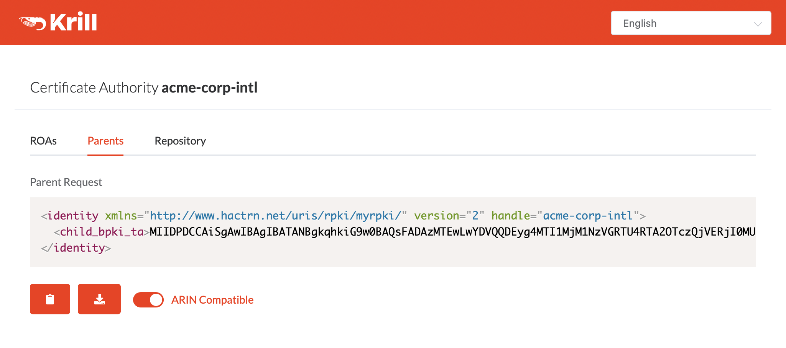
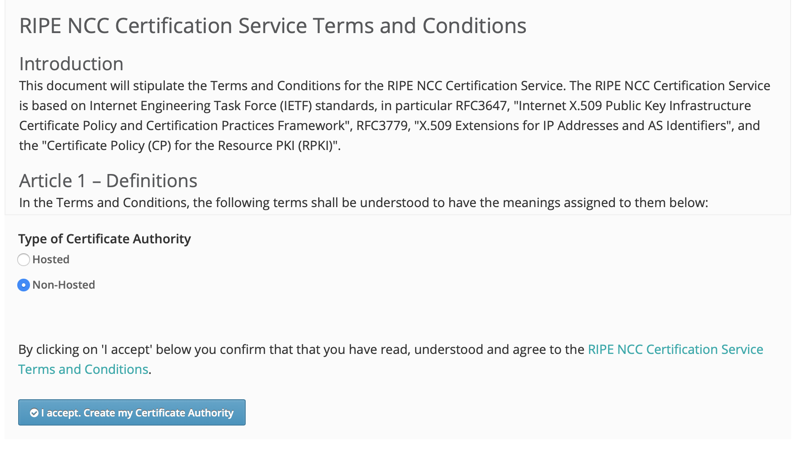

.. _doc_krill_parent_interactions:

RIR and NIR Interactions
========================

In almost all cases, you will interact with one or more Regional Internet
Registries (RIRs) or National Internet Registries (NIRs) when setting up
Delegated RPKI.

The fundamental principe is the same with each of them: the RIR or NIR needs to
establish who you are, which resources you are entitled to and where your
RPKI certificate and ROAs will be published.

Your identity, permissions and entitlements are all managed by the registry and
exposed via their respective member portals. The rest of the information is
exchanged in two XML files. You  will need to provide a child request generated
by Krill, and in return you will receive a parent response that you need to give
back to Krill.

Hosted Publication Server
-------------------------

Your RIR or NIR may also provide an RPKI publication server. You are free to
publish your certificate and ROAs anywhere you like, so a third party may
provide an RPKI publication server as well. To use this service you will need to
do an additional exchange. You need to generate and provide a publisher request
file and in return you will receive a repository response.

Using an RPKI publication server relieves you of the responsibility to keep
a public Rsync and web server running at all times to make your certificate and
ROAs available to the world.

At this time, none of the RIRs offer RPKI publication as a service for members,
though some have it on their roadmap. Currently, only the Brazilian registry
NIC.br provides an RPKI repository server for their members. As a result, in
most cases you will have to publish your certificate and ROAs yourself, as
described in the :ref:`doc_krill_publication_server` section.

Member Portals
--------------

If you hold resources in one or more RIR or NIR regions, you will need to have
access to the respective member portals and the permission to configure
Delegated RPKI.

* AFRINIC: https://my.afrinic.net
* APNIC: https://myapnic.net
* ARIN: https://account.arin.net
* LACNIC: http://milacnic.lacnic.net
* RIPE NCC: https://my.ripe.net

Some RIRs have a few considerations to keep in mind.

ARIN
""""

ARIN does not support the RFC 8183 key exchange format yet, but they do have it
`on their roadmap
<https://www.arin.net/participate/community/acsp/suggestions/2020-3/>`_. You can
still configure Delegated RPKI by transforming your request XML into the format
that ARIN accepts. You can do this with the toggle in the user interface or by
using `this XSL file
<https://raw.githubusercontent.com/dragonresearch/rpki.net/master/potpourri/oob-translate.xsl>`_.

    The "ARIN Compatible" toggle for the child request

Krill will accept both the old and standardised key exchange format, so there
is no need to transform the response file you get from ARIN.

RIPE NCC
""""""""

When you are a RIPE NCC member who does not have RPKI configured, you will be
presented with a choice if you would like to use Hosted or Non-Hosted RPKI.

    RIPE NCC RPKI setup screen

If you want to set up Delegated RPKI with Krill, you will have to choose
"Non-Hosted". If you are already using the Hosted service and you would like to
switch, then there is currently no option for that in the RIPE NCC portal.

Make a note of the ROAs you created and then send an email to rpki@ripe.net
requesting your Hosted CA to be deleted, making sure to mention your
registration id. After deletion, you will land on the setup screen from where
you can choose Non-Hosted RPKI.
