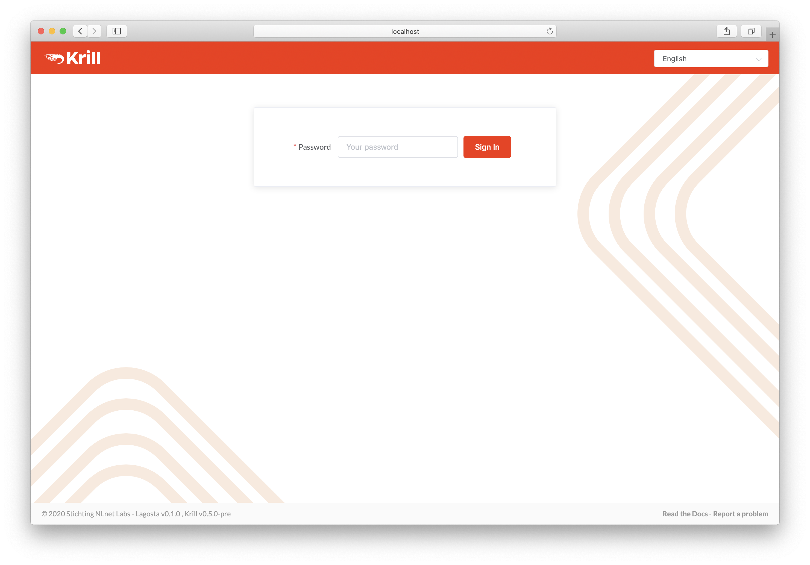
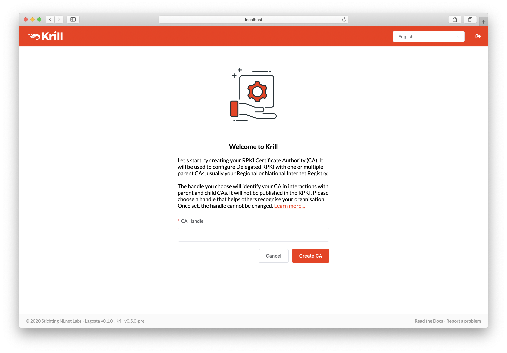
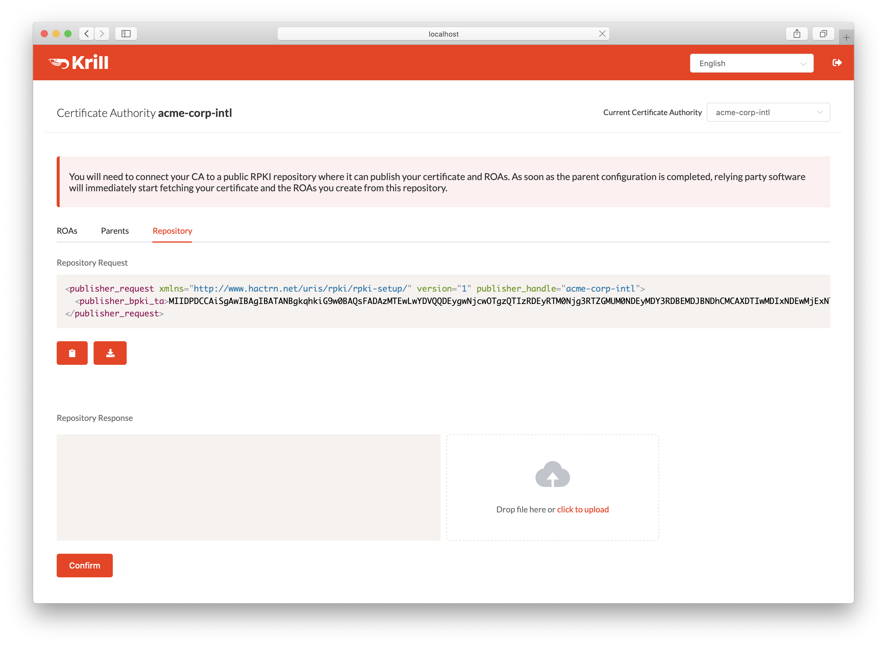
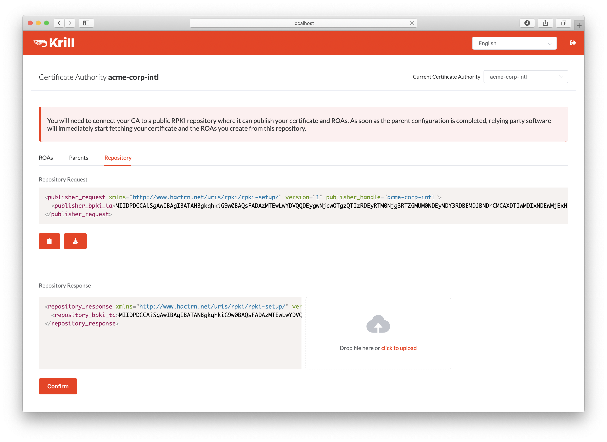
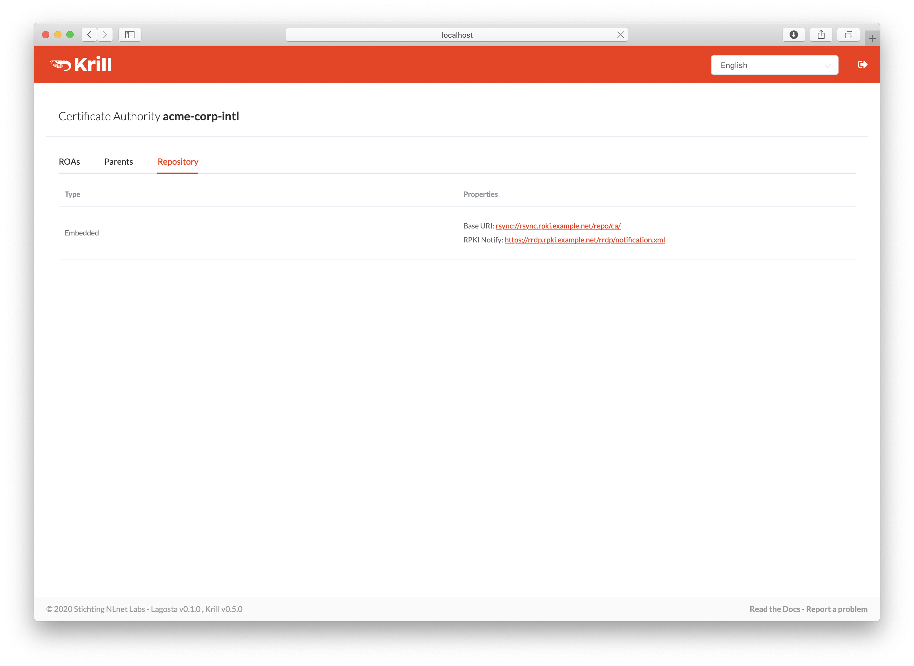
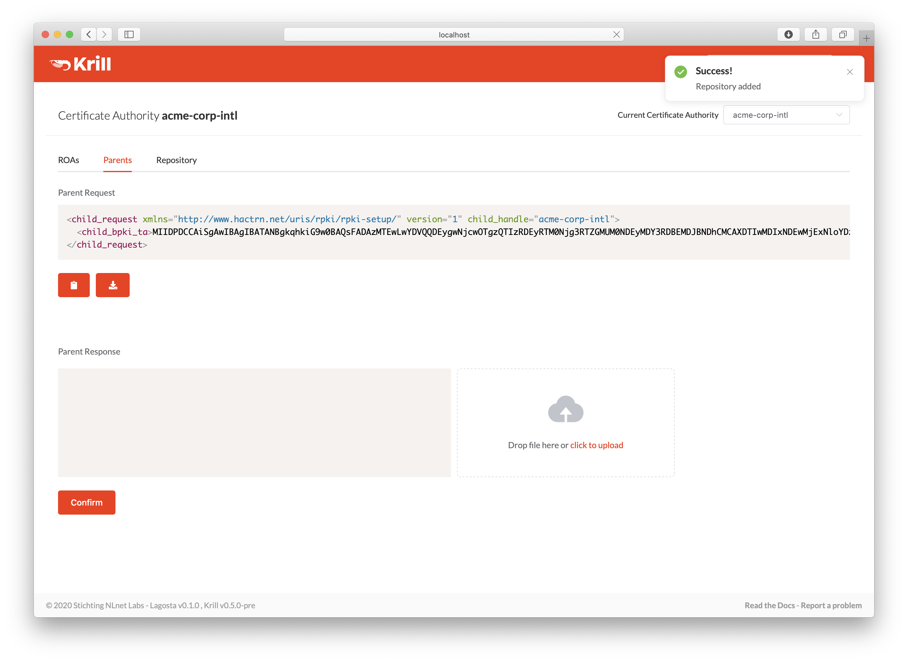
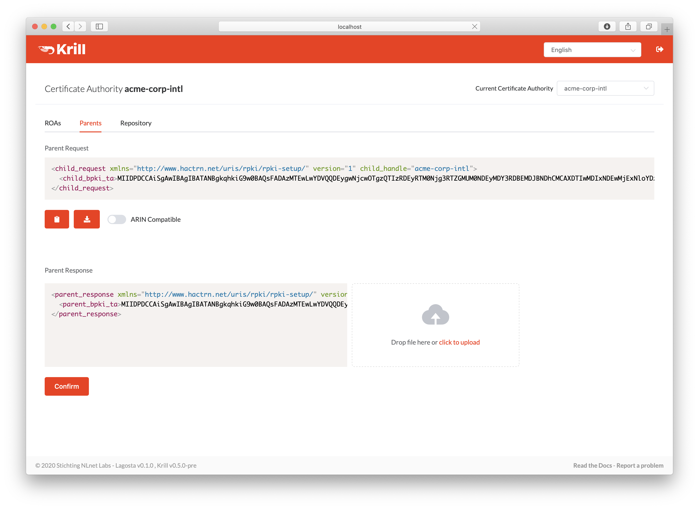
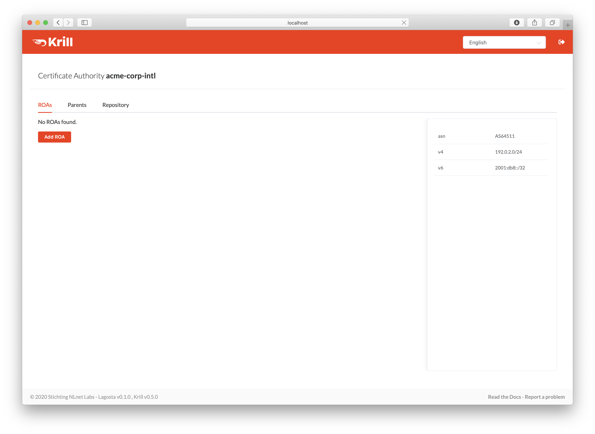

.. _doc_krill_using_ui:

Using the UI
============

For most use cases, the user interface is the easiest way to use Krill. Creating
a CA, connecting to a Regional or National Internet Registry parent and
publication server, as well as managing ROAs can all be done from the UI.

You can access the user interface in a browser on the server running Krill at
``https://localhost:3000``. By default, Krill generates a self-signed TLS
certificate, so you will have to accept the security warning that your browser
will give you.

If you want to access the UI from a different computer, you can either set up a
reverse proxy on your server running Krill, or set up local port forwarding with
SSH from your computer, for example:

.. code-block:: bash

  ssh -L 3000:localhost:3000 user@krillserver.example.net

Initial Setup
-------------

The first screen will ask you for the secret token you configured for Krill.

    Enter your secret token to access Krill

Next, you will see the Welcome screen where you can create your Certificate
Authority. It will be used to configure delegated RPKI with one or multiple
parent CAs, usually your Regional or National Internet Registry.

The handle you select is not published in the RPKI but used as identification to
parent and child CAs you interact with. Please choose a handle that helps others
recognise your organisation. Once set, the handle cannot be changed.

    Enter a handle for your Certificate Authority

.. _doc_krill_using_ui_repository_setup:

Repository Setup
----------------

Before Krill can request a certificate from a parent CA, it will need to know
where it will publish. You can add a parent before configuring a repository for
your CA, but in that case Krill will postpone requesting a certificate until
you have done so.

If you are using a third party repository, copy the publisher request XML
and supply it to your publication server provider.

    Copy the publisher request XML or download the file

Your publication server provider will give you a repository response XML, which
you need to paste or upload.

    Paste or upload the repository response XML

Alternatively, if you configured the embedded
:ref:`doc_krill_publication_server` using the CLI, this page will simply show
your repository details.

    Embedded repository details

Parent Setup
------------

After successfully configuring the repository, the next step is to configure
your parent CA. Copy the child request XML and provide it to your parent, i.e.
your RIR or NIR. 

    Copy the child request XML or download the file

Your RIR or NIR will provide you with a parent response XML, which you need to
paste or upload.

    Paste or upload the parent response XML

ROA Configuration
-----------------

After successfully setting up the parent exchange, you are now running delegated
RPKI. You can start creating ROAs for the resources you see in the pane on the
right.

    The ROAs screen displaying all resources and configured ROAs

Click the :guilabel:`Add ROA` button, then fill in the authorised ASN and one of
your prefixes in the form. The maximum prefix length will automatically match
the prefix you entered to follow best operational practices, but you can change
it as desired.

.. figure:: img/krill-ui-roa-add.png
    :align: center
    :width: 100%
    :alt: ROA creation

    Adding a new ROA
