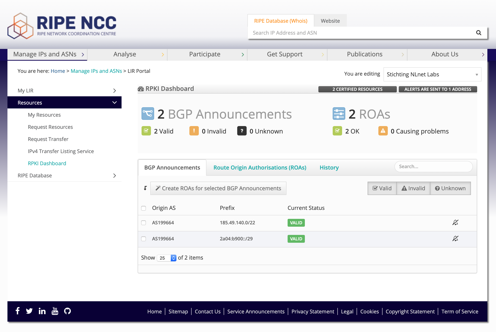

.. _doc_implementation_models:

Implementation Models
=====================

RPKI is designed to allow every resource holder to generate and publish cryptographic material on their own systems. This is commonly referred to as delegated RPKI. To offer a turn-key solution, each RIR also offers a hosted RPKI system in their member portals. Both models have their own advantages, based on the specific requirements of the organisation using the system.

No matter what implementation model you choose, it always a good idea to publish ROAs for your BGP announcements. Even when you are still evaluating how to deploy RPKI within your organisation, the benefits are immediate. Others can already filter based on what you publish, offering protection for you and other Internet users. For example, in case someone inadvertently announces your address space from their AS, it will be flagged as Invalid and dropped by everyone who has deployed route origin validation.

.. Important:: Once you start authorising announcements with RPKI, it is
               imperative that ROAs are created for all route origins from the
               prefixes you hold, including more specifics announced
               by other business units or customers. In addition, RPKI should
               become a standard part of operations, ensuring staff is trained
               and ROAs are continually monitored and maintained.

Hosted RPKI
-----------

In 2008, when the five RIRs committed to start offering RPKI services, it was clear that there would be an early adopters phase for a considerable amount of time. Given the past experiences with IPv6 and DNSSEC uptake, the RIRs decided to offer a hosted RPKI solution to lower the entry barrier into the technology. This way, organisations could easily get operational experience with the technology, without having to manage a certificate authority themselves.

Hosted RPKI offers a fair balance between ease-of-use, maintenance and flexibility. It allows users to log into their RIR member portal and request a resource certificate, which is securely hosted on the servers of the RIR. All cryptographic operations, such as key roll overs, are automated. The certificates and ROA are published in repositories hosted by the RIR. In short, there is nothing that the user has to manage, apart from creating and maintaining ROAs.

    Example of the Hosted RPKI interface of the RIPE NCC

The functionality and user interfaces of the hosted RPKI implementations vary greatly across the five RIRs. Despite these variations, if you are an organisation with a single ASN and a handful of statically announced IP address blocks that are not delegated to customers, hosted RPKI is sufficient for most use cases.

Functional differences across RIRs
""""""""""""""""""""""""""""""""""

This section provides an overview of the functionality each RIR provides to help users manage RPKI, which is summarised in the table below. 

First, the table indicates if the RPKI system supports setting up delegated RPKI, so users can run their own certificate authority if they want. When using the hosted RPKI system, there is an overview if multiple users can be authorised to manage ROAs, and whether they can authenticate using two-factors. 

To make management of ROAs easier, some systems provide a list of all announcements with certified address space that are seen by BGP route collectors, such as the `RIPE Routing Information Service (RIS) <https://www.ripe.net/analyse/internet-measurements/routing-information-service-ris>`_. ROAs have an explicit start and end validity date, but in some cases it is possible to automatically renew the ROAs, so that they are valid for as long as there is an entry in the web interface. In addition, it may be possible to synchronise the management of *"route"* objects in the IRR with the ROAs that are created. Lastly, an application programming interface (API) may be provided to make batch processing easier.

To improve retrieval of published RPKI data by relying party software, the `RPKI Repository Delta Protocol (RRDP) protocol <https://tools.ietf.org/html/rfc8182>`_ was developed. Support for this standard is listed as well.

+-----------------------+----------+----------+----------+----------+----------+
|                       | APNIC    | AFRINIC  | ARIN     | LACNIC   | RIPE NCC |
+=======================+==========+==========+==========+==========+==========+
| Support for delegated |  Yes     | Yes      | Yes      | No [1]_  | Yes [2]_ |
| RPKI                  |          |          |          |          |          |
+-----------------------+----------+----------+----------+----------+----------+
| Multi-user support    |  Yes     | Yes [3]_ | Yes      | No       | Yes      |
+-----------------------+----------+----------+----------+----------+----------+
| Two-factor            |  Yes     | No       | Yes [4]_ | No       | Yes      |
| authentication        |          |          |          |          |          |
+-----------------------+----------+----------+----------+----------+----------+
| BGP route collector   |  Yes     | No       | No       | Yes      | Yes      |
| suggestions           |          |          |          |          |          |
+-----------------------+----------+----------+----------+----------+----------+
| Auto-renew ROAs       |  Yes     | No       | No       | Yes [5]_ | Yes      |
+-----------------------+----------+----------+----------+----------+----------+
| Match "route" objects |  Yes     | No       | No       | No       | No       |
| with ROAs             |          |          |          |          |          |
+-----------------------+----------+----------+----------+----------+----------+
| API                   |  No      | No       | Yes [6]_ | No       | Yes      |
+-----------------------+----------+----------+----------+----------+----------+
| Publication via RRDP  |  Yes     | No       | No       | No       | Yes      |
+-----------------------+----------+----------+----------+----------+----------+
| Nonrepudiation [7_]   |  No      | No       | Yes      | No       | No       |
+-----------------------+----------+----------+----------+----------+----------+

.. [1] Coming late 2019.
.. [2] Currently upon request only.
.. [3] Requires a `client X.509 certificate <https://afrinic.net/support/bpki-for-election-purposes/bpki-enrolment-process>`_ to use RPKI.
.. [4] Requires a `ROA Request Key Pair <https://www.arin.net/resources/manage/rpki/hosted/#roarequestkeypair>`_.
.. [5] Explicit opt-in feature.
.. [6] Only possible to create ROAs; no list, update or delete.
.. [7] `Nonrepudiation <https://www.arin.net/resources/manage/rpki/faq/#why-must-i-create-a-key-pair-to-use-rpki>`_ refers to the inability for a party to dispute or deny having performed an action.

A final differentiator is the publication interval of each RIR repository. Please keep in mind that once a ROA is created by a user in one of the hosted systems, it can take between several minutes up to `multiple hours <https://www.arin.net/resources/manage/rpki/faq/#how-often-does-arin-update-the-repository>`_ before the object is published and available for download, depending on the RIR system you use.

Delegated RPKI
--------------

Operators who prefer more control and have better integration with their systems can run their own child CA. This is model is usually referred to as delegated RPKI. 

In this model, the certificate authority that manages object signing is functionally separated from the publication of cryptographic material. This means that an organisation can run a CA and either publish themselves, or delegate this responsibility to a third party, such as a hosting company or cloud provider. 

There may be various reasons for organisations to choose this model. For example, this may be useful for organisations that need to be able to delegate RPKI to their customers or different business units, so that that they can run their a CA on their systems and manage ROAs themselves.

Alternatively, enterprises who manage large amounts of address space across various RIRs, may not want to manage ROAs in up to five different web interfaces. Instead, they might prefer to be operationally independent from the RIR and manage everything from within one package that is tightly integrated with IP address management and provisioning systems.

Lastly, in the LACNIC and APNIC regions there are several National Internet Registries who provide registration services on a national level to their members and constituents. They also need to be operationally independent and run a certificate authority as a child of their RIR.
